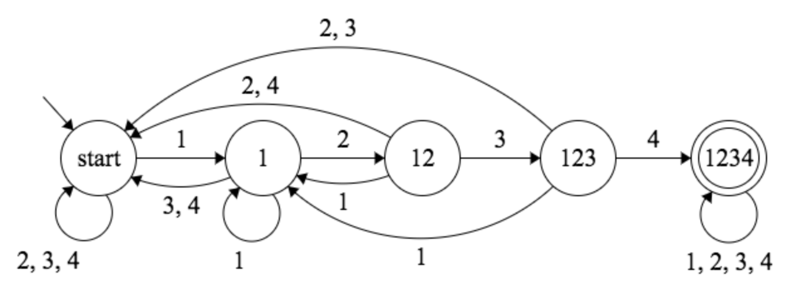
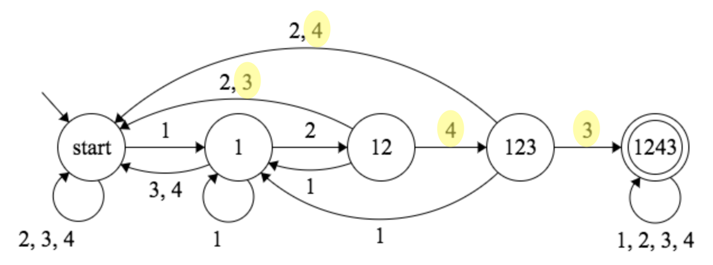
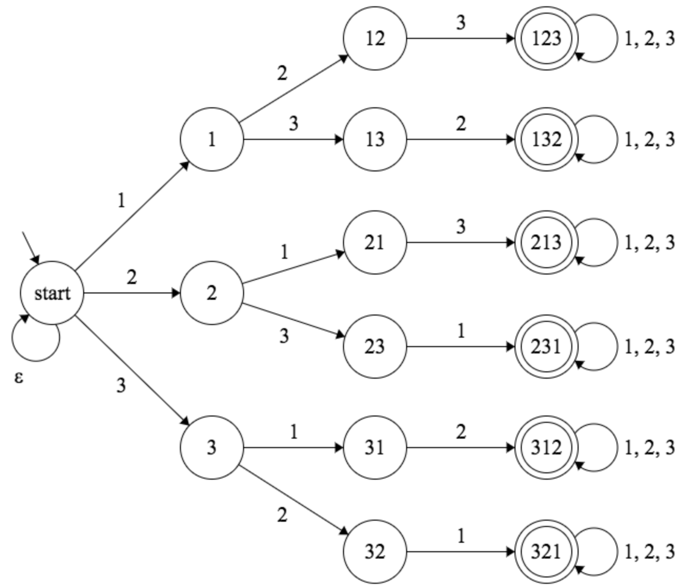

## Supersat

An attempt to find superpermutations via a reduction of finite state machines to the
[boolean satisfiability problem](https://en.wikipedia.org/wiki/Boolean_satisfiability_problem).

## Setup

To run the test suite:

```
cargo test
```

To run the application:

```
cargo run --release
```

## Overview

This is my third attempt at the superpermutation problem. This time I decided to
reduce the problem to SAT and run a state of the art SAT solver on the resulting
equation. This is very much inspired by my [experimental programming language](https://sentient-lang.org/)
and prior success in reducing problems to SAT.

Unfortunately, I did not manage to solve any unsolved superpermutation problems,
but I was successful in reducing the problem to SAT which is explained in detail
below. My hope is that someone with greater experience encoding problems in SAT
can take these ideas and experiment with different techniques to see if it's
possible to find superpermutations by this approach.

## Sorry this isn't a paper

I think there's more than enough interesting material here to write a paper, but
I'd like to move onto other things as I've already invested a lot of time into
this problem. I'm an independent researcher and its expensive for me commit the
additional time and energy required to this endeavour.

Instead, I'll try to explain things as best I can here.

## An observation

This project stems from the idea that we can define a language `S` of
superpermutations. We can create a finite state machine that recognises all
strings in the language so that it accepts strings that are valid
superpermutations and rejects strings that are not.

## One possible approach

A superpermutation is defined as 'a string that contains all permutations for N
symbols' and so we can construct our finite state machine by intersecting
simpler machines that recognise each of the permutations. In other words, we can
take the cartesian product of N! machines.

This is a widely studied area and there are existing tools that can do this for
us. For example [Ragel](https://en.wikipedia.org/wiki/Ragel) can generate finite
state machines from regular expressions, so for N=3 we can construct our state
machine as follows:

```ragel
// definition.rl

%%{
  machine S;

  main :=
    [123]* '123' [123]* &
    [123]* '132' [123]* &
    [123]* '213' [123]* &
    [123]* '231' [123]* &
    [123]* '312' [123]* &
    [123]* '321' [123]* ;
}%%
```

We can then turn this into a graph like so:

```sh
ragel -V definition.rl > graph.dot
dot -Tpng graph.dot > graph.png
```

This generates a rather large finite state machine that can be seen [here](images/graph-3-full.png).

The above machine will accept any string that is a superpermutation for N=3. As
it stands, this isn't very useful, but we can leverage this approach to find
minimal superpermutations (i.e. the shortest) for some N.

The way to do this is to intersect a machine that accepts strings of a given
length. If the length is shorter than the minimal superpermutation, the
resulting machine won't accept any strings (i.e. the language will be
empty). We can incrementally increase the length of the string until the result
is a machine that accepts something.

Before presenting this definition, there are some optimisations we can apply:

1. When listing the regular expressions to intersect, we start with the one that
limits the length of the string. This is more efficient because the diameter of
the resulting graph is limited by this length at each stage of intersection. If
instead we intersected this regular expression at the end, we'd effectively
generate the entire machine as previously before throwing most of it away.

2. We can insist the string begins '123' to
[break symmetries](https://en.wikipedia.org/wiki/Symmetry_breaking). In theory
this should reduce the amount of work by N! and we lose no generality by doing
this. We may as well combine this with the regular expression that limits the
length. The other regular expressions can now be changed to begin `[123]+`
instead of [Kleene star](https://en.wikipedia.org/wiki/Kleene_star) since we
know these permutation do not occur at the start of the string.

We know the shortest superpermutation for N=3 has length 9, so here's the
definition of that machine:

```
%%{
  machine S;

  main :=
       '123' [123]{6}   &

    [123]+ '132' [123]* &
    [123]+ '213' [123]* &
    [123]+ '231' [123]* &
    [123]+ '312' [123]* &
    [123]+ '321' [123]* ;
}%%
```

This generates a final state machine with 10 states that can be seen [here](images/graph-3-09.png).

The transitions are the ASCII characters for '1', '2' and '3'. The only string
this machine accepts is '123121321' which is the minimal superpermutation.

If instead, we limited the length to 8 (which would be defined as `{5}`), the
resulting machine wouldn't accept anything as seen [here](images/graph-empty.png).

If instead, we limited the length to larger values, these are the resulting
machines:
  - [graph for length 10](images/graph-3-10.png)
  - [graph for length 11](images/graph-3-11.png)
  - [graph for length 12](images/graph-3-12.png)

These machines accept strings that are superpermutations of length 10, 11 and 12
respectively. I think these graphs are quite pretty.

## Larger values of N

Here is the machine definition for the shortest superpermutation for N=4:

```
%%{
  machine S;

  main :=
      '1234' [1234]{29}    &

    [1234]+ '1243' [1234]* &
    [1234]+ '1324' [1234]* &
    [1234]+ '1342' [1234]* &
    [1234]+ '1423' [1234]* &
    [1234]+ '1432' [1234]* &
    [1234]+ '2134' [1234]* &
    [1234]+ '2143' [1234]* &
    [1234]+ '2314' [1234]* &
    [1234]+ '2341' [1234]* &
    [1234]+ '2413' [1234]* &
    [1234]+ '2431' [1234]* &
    [1234]+ '3124' [1234]* &
    [1234]+ '3142' [1234]* &
    [1234]+ '3214' [1234]* &
    [1234]+ '3241' [1234]* &
    [1234]+ '3412' [1234]* &
    [1234]+ '3421' [1234]* &
    [1234]+ '4123' [1234]* &
    [1234]+ '4132' [1234]* &
    [1234]+ '4213' [1234]* &
    [1234]+ '4231' [1234]* &
    [1234]+ '4312' [1234]* &
    [1234]+ '4321' [1234]* ;
}%%
```

Resulting in [this machine](images/graph-4-33.png) which accepts the minimal
superpermutation which is '123412314231243121342132413214321'.

Again, if we decrease the length by 1, the [resulting machine](images/graph-empty.png)
won't accept anything.

If we increase it by 1 to 34, [this is the result](images/graph-4-34.png).

For N=5, the approach breaks down and Ragel takes too long to generate the
machine. As the length increases, it takes an exponentially increasing amount of
time:

- length 50 takes ~1 second to generate
- length 60 takes ~6 seconds to generate
- length 70 takes ~50 seconds to generate
- length 80 takes ~15 minutes to generate

The shortest superpermutation for N=5 has length 153, so it's a long way from
being able to generate this in a reasonable amount of time.

There could be more optimisations, perhaps by subdividing the regular
expressions into groups, computing the cartesian products of these, then
combining at the end, but I didn't explore this avenue further. Even if we
could generate this machine for N=5, I'd be surprised if this scaled to N=6

It would interesting to do some complexity analysis on this approach to see how
it scales. Under the hood, I think Ragel uses
[Hopcroft's algorithm](https://en.wikipedia.org/wiki/DFA_minimization#Hopcroft's_algorithm)
to minimize finite state machines and the cartesian product of two machines can
result in AxB the number of states in the worst case.

## An alternative approach

Rather than trying to construct a finite state machine that is the cartesian
product of smaller machines, we could instead think about running these smaller
machines in parallel over the string. If they all reach their accepting state
then the string is a superpermutation.

Here's a machine that accepts strings containing '1234':



Here's a machine that accepts strings containing '1243':



Notice that the only difference between these machines are the transitions from
the '12' and '123' states as highlighted above. When these machines are run in
parallel, we know that whenever the '1234' machine is in state '12', so will
the '1243' machine. That means these states are non-distinguishable and can be
collapsed into one.

Therefore, a more natural way to think about running these machines in parallel
is instead to construct a non-deterministic machine that can be in multiple
states at once.

Here's a non-deterministic machine for N=3:



This machine will share as much state as possible when it runs over the string.
In general, the number of states in the first rank will be N, then N x N-1, etc.
So for N=6, there will be a total of 6 + 30 + 120 + 360 + 720 + 720 = 1956 states.

However, notice that this machine isn't quite what we want. It no longer accepts
superpermutations because, by definition, a non-deterministic machine accepts
its input if **any** final state is reached. We want our machine to accept its
input if **all** final states are reached. We'll address this shortly.

Before doing so, here are some things noteworthy about this machine:

1) This machine is essentially a [trie](https://en.wikipedia.org/wiki/Trie) of
all permutations for N

2) This machine has the useful property that it can only be in one state of each
'rank' at a time. Here a 'rank' is defined as the set of states representing
substrings of the same length, for example, `12, 13, 21, 23, 31, 32` form a rank

3) It is possible for the machine to not be in any states for a rank, except the
first rank which will always have an active state of the symbol that has just
been read from the input string

As it stands, we don't have a method of finding superpermutations. The machine
above will only accept strings that are superpermutations (provided we change
the semantics for when a string is accepted to specify that all final states are
reached). We will address this now by formulating a boolean satisfiability
problem.

## Boolean Satisfiability

This approach takes inspiration from [this paper](https://arxiv.org/pdf/1402.2184.pdf)
which successfully proved the Erdos Discrepancy Conjecture for C=2. We will
attempt to reduce the problem of finding superpermutations to SAT and run
state-of-the-art SAT solvers on the resulting equation.

Our approach will take the non-deterministic state machine detailed above and
transform this into a problem of boolean logic so that the formula is
satisfiability if and only if **all** final states are reached after the machine
has read its input.

In the following sections, the reduction will be described.

**1. Representing states**

To represent states, we make use of the observation that the machine can be in a
maximum of one state at a time in each rank. This means we can represent a rank
of states as a binary number indicating the state that is active in the rank.
Each bit in the binary number corresponds to a variable in the SAT equation.

For the case when no states are active, we'll insist the machine is in a 'dead'
state for that rank, which we'll number 0 in our binary representation. That
means for N=6, we'd need the following number of variables per rank:

```
rank 0: 3 variables         //   ceil[ log2(6)          ] = 3 bits
rank 1: 5 variables         //   ceil[ log2(30 + dead)  ] = 5 bits
rank 2: 7 variables         //   ceil[ log2(120 + dead) ] = 7 bits
rank 3: 9 variables         //   ceil[ log2(360 + dead) ] = 9 bits
rank 4: 10 variables        //   ceil[ log2(720 + dead) ] = 10 bits
rank 5: 10 variables        //   ceil[ log2(720 + dead) ] = 10 bits
```

In total, this means we need 44 variables to represent the machine's state for
N=6. If we'd taken the alternative approach of representing states as individual
variables in the SAT equation, we'd instead need 1956 variables. It is not clear
that reducing the number of variables in this way necessarily helps the SAT
solver but this is the approach taken in the Erdos paper, so we opt to do the
same here.

An interesting line of investigation would be to experiment with different state
representations and see what impact this has on various solvers.

**2. Representing time**

As the machine scans the input string, it changes state. Therefore, we need to
represent the state of the machine at each point in time. We introduce the
notion of a 'snapshot' which is the state of the machine after scanning each
character of the input string. If each snapshot contains 44 variables, then to
test a string of length 872, which is the shortest known superpermutation for
N=6 would require 44 x 872 = 38,368 variables.

**3. Representing input**

To model the input string, we don't need to add any additional clauses. Instead,
we leave the first rank of states in the machine unconstrained and treat this as
the input string. For example, if state '1' is active at time=0 then this
represents a '1' at the start of the input string.

**4. Modelling transitions**

To model the behaviour of the machine, we add clauses for the state transitions.
These are implications between states in consecutive snapshots, according to the
graph of the machine presented above. If the machine is in some state at time
t, then it may transition to the next state at t+1 if the symbol that was just
read as input matches the transition.

Here is an example clause that is added:

```
State(name=12, time=5) -> State(name=123, time=6) ^ Input(symbol=3, time=6)
```

Which is equivalent to the following:

```
State(name=12, time=5) -> State(name=123, time=6) ^ State(name=3, time=6)
```

Of course, this isn't in conjunctive normal form and a state is represented by
multiple bits. To convert this to CNF, we use equivalence rules. If A and B are
sequences of 3 bits, then `A -> B` can be written in CNF as:

```
(-a0 v -a1 v -a2 v b0) ^ (-a0 v -a1 v -a2 v b1) ^ (-a0 v -a1 v -a2 v b2)
```

We also add clauses for the implication in the opposite direction:

```
State(name=123, time=6) ^ State(name=3, time=6) -> State(name=12, time=5)
```

Strictly speaking, we only need implication in one direction, but adding both
seems to help the solver find a solution more quickly. I'd speculate this is
because it removes ambiguity from the SAT solver about whether to set the state
but this requires more analysis.

Finally, we do not add explicit transitions for the dead states, nor do we add
the 'looping' transitions on the final states. Instead, we handle these cases
differently as explained later.

**5. Modelling the dead state**

Our choice of encoding for states means that a unique number is determined for
each rank, corresponding to one state being set in each rank. We arbitrarily
number dead states as 0 but currently our binary representation does not
preclude numbers that do not correspond to states.

Therefore, we add clauses to explicitly ban all numbers that do not correspond
to states. If the numbers 0 to 12 correspond to valid states then that means we're
using 4 bits for this rank and need to ban the numbers 13 to 15. In binary, 13,
14 and 15 are represented as 1101, 1110 and 1111 respectively. For the following
clauses, we'll use a, b, c, d to denote the variables for each bit from left to
right:

```
(-a v -b v c v -d) ^      // ban 13
(-a v -b v -c v -d) ^     // ban 14
(-a v -b v -c v d)        // ban 15
```

To take the 'ban 13' clause as an example, this will be false for the assignment
`a=true, b=true, c=false, d=true` in the SAT equation, so it must choose
something else.

When we take the transition clauses and combine these with the clauses to ban
invalid numbered states, the result is the dead state is the only remaining
state available for the machine to be in.

This would be the case, for example, when the input string contains repeated
symbols that do not correspond to permutations, e.g. '12333'.

**6. Modelling the final states**

As mentioned above, we do not add 'looping' transitions on the final states. We
could do, but this would result in a lot of clauses and there's a more efficient
way to encode the requirement that each of the final states must be reached.

Our approach introduces an additional set of variables for each permutation that
we'll refer to as the 'Goal'. The intended meaning of these variables is to
represent another number in binary. Each number is the time at which the machine
is in the final state for that permutation. So, for example, if the '321'
permutation appears at time 5 in the input string then the number corresponding
to permutation '321' would be 5.

We model this in CNF by adding clauses of the form:

```
Goal(name=321, time=5) -> State(name=321, time=5)
```

We then ban all binary numbers that do not map to valid times that are beyond
the length of the input string. We use the technique described in the previous
section to do this. The result is that every permutation must occur in the input
string at least once since the goal variables must refer to a time at which the
final state is true for that permutation.

**7. Initial configuration**

We also add clauses to break symmetries so that the input string begins with
ascending numbers. This is to break symmetries in the problem domain:

```
State(name=1, time=0)
State(name=2, time=1)
State(name=3, time=2)
```

We also add clauses that insist all the dead states are initially active in the
machine. This prevents final states being reached before the necessary
permutation has been read in the input string. We use '00' to refer to the dead
state in the second rank and '000' for the dead state in the third rank:

```
State(name=00, time=0)
State(name=000, time=0)
```

And this completes our encoding of the state machine into the boolean
satisfiability problem.

## An extension

As mentioned in the overview section, I did not manage to solve any unsolved
problems by this approach. The resulting SAT formula for N=6 has approximately
40 million clauses and having run a variety of SAT solvers for several days,
they did not manage to find a satisfying assignment for a length of 871, nor
prove that one is impossible.

However, before drawing a line under this approach, I decided to add an
extension in the hope this could help the SAT solvers work in a more incremental
fashion towards a solution. I tried to use the ideas from the algorithm
presented in [this blog post](http://www.njohnston.ca/2014/08/all-minimal-superpermutations-on-five-symbols-have-been-found/)
and model the same constraints in the SAT problem.

The basic idea is to limit the number of 'wasted symbols' that may occur at each
point in string. The hope is that this forces the SAT solver to eliminate
regions of the search space sooner than it would otherwise and more rapidly find
a solution or prove that one is impossible. I won't re-explain the high-level
approach of finding the "maximum number of permutation that fit into a string of
given length". Instead, I'll refer you to the blog post for more details about
how this works.

The following sections explain an extension of the reduction to incorporate
limiting the number of wasted symbols.

**1) Modelling a wasted symbol**

If the machine is in the dead state in its final rank then it must mean the
symbol that was just read is a wasted symbol. However, there's another case when
a symbol is wasted which is when a permutation has already occurred in the
string and the final state for that permutation is active again.

Handling this second case is problematic. In our approach we do the following:

a) Reverse the direction of implication for the Goal states:

```
State(name=321, time=5) -> Goal(name=321, time=5)
```

This has the effect of ensuring whenever a final state is reached, the goal
state for that permutation has its number set to the current time. However, it
also changes the semantics so that no final state can be reached more than once
since the number of the goal state must be unique.

At time of writing, it isn't known whether the minimal superpermutation for
N > 5 always contains one of each permutation. For 1 <= N <= 5, there is only
one of each permutation in the string, but it hasn't been proven whether this
property holds as N increases. However, for our purposes, this seems like a
reasonable restriction to make as an initial exploration of the problem.

b) Remove the ban on number zero for 'Goal' states

With the above change in place, each permutation must occur exactly once in the
string. However, we want our algorithm to run incrementally so we can discover
the maximum number of permutations that fit into strings of given length.
Therefore, we want to relax the requirement that each permutation must occur
exactly once and instead specify they can occur at most once.

This will allow us to control how many permutations must occur in the string.
How this is done is explained in more detail further on. For now, to change the
'exactly once' to an 'at most once', we remove the ban on the number for each
goal state being the number zero which we think of as another kind of 'dead'
state. This has the effect that goal states for permutations not in the string
can take on a value of zero which has the desired effect.

c) Introduce variables for the wasted symbols

Now that permutations may occur a maximum of once in string, The case when
'a permutation has already occurred in the string' can no longer happen. That
means we can reliably use the dead states in the machine's final rank to
indicate whether a symbol is wasted. For convenience, we introduce a new
variable for each point in time which is true if and only if the machine is in
the dead state at that time:

```
State(name=000, time=5) -> Wasted(time=5)
Wasted(time=5) -> State(name=000, time=5)
```

We now have a set of variables that are true if and only if wasted symbols occur
in the string at each point in time.

**2) Modelling the maximum number of wasted symbols**

We want to limit the number of wasted symbols that may occur at different points
in the string based on the known bounds for the maximum number of permutations
that fit into a string with some number of wasted symbols. To achieve this, we
need some means of encoding an 'at most k' constraint for the number of wasted
symbols and increasing the value of k at later points in the string.

There are several ways to encode an 'at most k' constraint. There is a useful
comparison in [this paper](http://www.cs.toronto.edu/~fbacchus/csc2512/at_most_k.pdf).

For our purposes, we choose the 'Sequential Counter Encoding'. The primary
reason for this is, after some analysis, we found a way to adapt this encoding
so the value of k can be varied at different points in the string. There's also
a natural way to extend this encoding to incorporate an 'at least k' constraint
which will be explained later.

Note: We think there's a small mistake in the paper in clause (5). The second
literal should be negated to specify the 'can't be an overflow' constraint.

Rather than re-explain how the encoding works, we'll instead focus on how the
value of k can be varied with reference to the paper. In short, we vary the
number of counter bits in each register so that it is equal to the desired value
of k at each point in time. We omit clauses (3) and (4) when there's no
corresponding counter bit in the previous register.

This is consistent with the encoding since we know the count represented by this
bit cannot occur in the previous register and therefore can by thought of as
being 'false'. Since false can imply true or false, these clauses can be
omitted as it does not constrain the current register's bit.

Finally, if the value of k is zero, i.e. no wasted symbols may occur at that
point in the string, we encode this by adding clauses contradicting the variable
for the wasted symbols.

```
-Wasted(time=0) ^
-Wasted(time=1) ^
-Wasted(time=2)
```

This is not handled in the paper because it only considers values 1 <= k <= n.

**3) Modelling minimum number of wasted symbols**

We also decided to encode constraints on the minimum number of wasted symbols
that must occur at points in the string. Since we know the maximum number of
permutations that fit into strings that waste some number of symbols, we also
know points in the string at which some number of wasted symbols must have
occurred. The hope, again, is this will help eliminate regions of the search
space and speed up solving the problem.

To encode a minimum on the number of wasted symbols, we modify our sequential
counter encoding once more. This time, we add a tautological clause for the
previous register's counter bit in place of clause (3) when there's no counter
bit in the current register because the corresponding number is less than the
minimum value of k:

```
Register(count=1, time=4) ^
Register(count=2, time=4) ^
Register(count=3, time=4)
```

This is consistent with the encoding since we know all counter bits below the
minimum value of k must have been set in the previous register, otherwise the
current register's count would be below the minimum. This also means we don't
need variables to represent counts below these minimum k values, reducing the
number of variables in our encoding.


**4) Determining the bounds**

For each position in the string, we want to specify a range of values for k
based on the ideas presented in
[the aforementioned blog post](http://www.njohnston.ca/2014/08/all-minimal-superpermutations-on-five-symbols-have-been-found/).
We do this by incrementally generating SAT problems of different length and
then running a SAT solver on them. If the problem can be satisfied it means it's
possible to fit the required number of permutations into the given length,
otherwise it is not and we can update our bounds with this new information.

This incremental approach means we're running the SAT solver on the same problem
several times with small variations in the clauses relating to the counter bits.
Many solvers provide an incremental API that can improve the performance in
cases like this called [IPASIR](http://www.cs.utexas.edu/users/moore/acl2/manuals/current/manual/index-seo.php/IPASIR____IPASIR).
The basic idea being that knowledge attained about the problem in one solve is
often reusable in a subsequent solve. However, we did not try this approach due
to the expected difficulty integrating this API with Rust but this might be an
interesting line of investigation.

## Closing remarks

As mentioned in the overview section, this approach was ultimately unsuccessful
in solving the more challenging superpermutation problems. For N=6, the solvers
don't get very far before they begin to take exponentially increasing amounts of
time to determine the satisfiability of each of the incremental subproblems.

We tried
[lingeling](http://fmv.jku.at/lingeling/),
[treengeling](http://fmv.jku.at/lingeling/),
[cadical](http://fmv.jku.at/cadical/),
[riss](http://tools.computational-logic.org/content/riss.php)
and [cryptominisat](https://www.msoos.org/cryptominisat5/) and observed similar
performance. Of these, treengeling is a parallel, cube-and-conquer solver which
we expected to perform the best because of reasons explained in
[this paper](https://www.cs.utexas.edu/~marijn/publications/CCshort.pdf) but
found lingeling and cadical perform better in practice.

If we had to speculate as to why the problem is particularly challenging for SAT
solvers, we think the following reasons are contributing factors:

- It's difficult to encode cardinality constraints in SAT which we use in our
extended approach. There are a lot of ways to do this and it's not clear how
each of the solvers will perform on each of them

- The superpermutation problem has similarities with the pidgeonhole problem in
that there are a lot of combinations to try and we're trying to fit some number
of permutations into strings of different length. For resolution-based SAT
solvers (of which most of them are), [it has been proven](https://arxiv.org/pdf/1705.01477.pdf)
that the pidgeonhole problem is a hard instance to solve

There's ongoing work to build SAT solvers that use richer proof systems, such
as [cutting planes](https://en.wikipedia.org/wiki/Cutting-plane_method), but for
the time being resolution- and CDCL-based solvers tend to outpace these solvers.

As I mentioned earlier, I'm sorry all the above isn't presented in a paper. I
think there's a lot of possible research directions that could be taken. In
particular, a formal analysis of various encodings and solver performance would
be an excellent line of investigation. Additionally, I think these problems are
particularly challenging for SAT solvers and this could help improve the solvers
themselves. I'd like to submit some of these problems as benchmarks in
[the annual SAT competitions](https://www.cs.helsinki.fi/u/mjarvisa/papers/jarvisalo-leberre-roussel-simon.aimag.pdf).

If you'd like to contact me about any of this work, my email address is listed
on [my GitHub profile](https://github.com/tuzz). Thanks.
